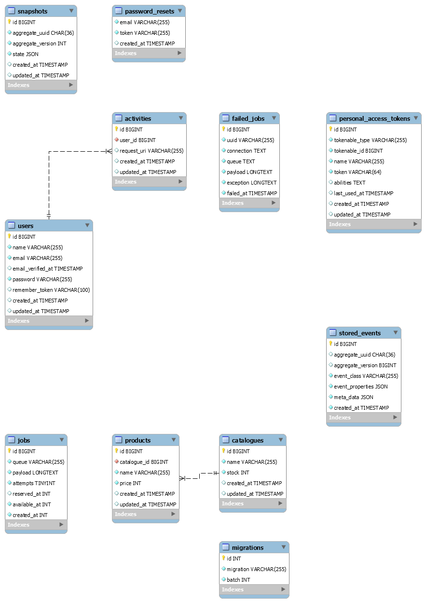

# Basic Project Application

A very simple project writeup using Laravel to showcase some important fundamentals.

The site is just a simple shopping cart (traditional demonstration) to cover the majority of major concepts a typical web application goes through

- [x] Authentication
- [x] Authorisation
- [x] Routing
- [x] Validation
- [x] Queues 
- [x] Dependency injection & dependency inversion
- [ ] Behaviour driven design
- [x] Test driven design
- [x] Domain driven design
- [x] Type driven design
- [ ] Service provider usage
- [x] Service discovery
- [x] MVC usage
- [x] S.O.L.I.D examples
  - [x] Separation of concerns
  - [x] Open/Closed principle
  - [ ] Liskov Substitution principle
    - *tricky to show in a demo like this*
  - [ ] Interface segregation principle
    - *didn't manage to get to a stage to show this*
  - [x] Dependency inversion principle
- [x] Higher order function examples
- [x] Event driven design
- [x] Event sourcing & CQRS
- [x] Basic REST endpoints
- [ ] Basic GraphQL
- [ ] Basic Swagger API
- [x] Database seeding
- [x] Database migrations
- [x] Database normalisation (png image), indexing & constraint strategies
- [ ] Basic use case
- [x] Basic ER diagram

## ER

